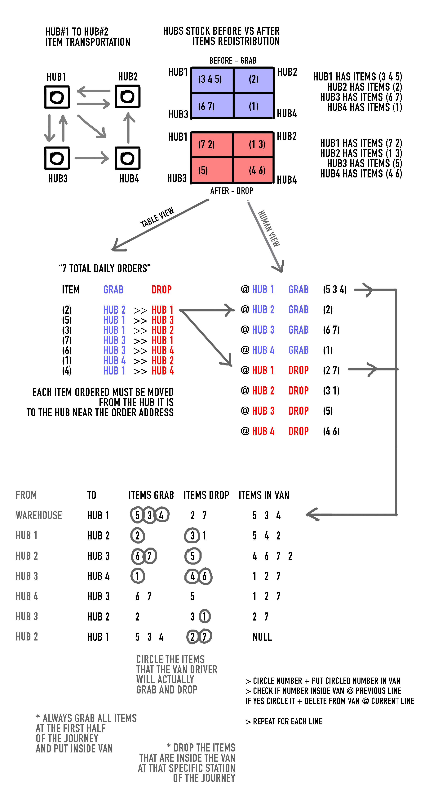

# PROBLEM BACKGROUND

During COVID because of the surge of customer to online shopping and government rules that made it difficult for shipping companies to respond. The result was [extreme shipping delays](https://www.thenationalherald.com/greeces-delivery-services-cant-keep-up-with-covid-19-lockdown-demand/) that could go up to one month of delivery time.

At some point the government made it possible to order online and make an appointment to pick up the purchase from the store. Local small private laundrette businesses spread all over athens not only were able to operate under that scheme because of the small number of employers, but also in many cases had their own transportation vehicle to pick up and return clothes to customers in the local vicinity. That "delivery system" was unaffected by the shipping delays of the big shipping companies.

At the same time out of the 20 people working at the company warehouse, by government mandate only 3 were allowed to work at the same time. That made stock managing and order fullfillment practically impossible since the warehouse was not operational.

# SOLUTION

This is when i came up with a solution to the problem of shipping delays for the eshop for which after 10+ years of operations the orders had tripled in just a few months but was unable to fullfill them.

The main idea was to not only partner with the laundrettes (HUBS) for the last-mile delivery but also use them as storage facilities that would use their personal to do the fullfillment.

## Step by step

1. **PARNER WITH LAUNDRETTES (HUBS)**: we get in contact and partner with laundrettes (aka HUBS) whose delivery range covers the majority of the area of the city of athens. The goal, which is realistic, is to cover at least 80% of all orders in the city.

2. **ASSIGN NEAREST HUB TO ORDER**: each e-shop order with delivery address in athens (which accounted 77% of the total orders) is manually assigned the geographically nearest hub. this assignment can be automated in the future.

3. **DAILY VAN JOURNEY THOUGH HUBS**: every morning a company owned van starts from the company warehouse, passes through all the hubs and comes back to the warehouse. the purpose is to distribute and store the available stock from the warehouse to the hubs, but also re-distribute the stock that already is stored in the hubs depending on the daily orders.

4. **DAILY ORDERS FILE**: each day the company keeps a single record of all the orders. at the end of the day we have a file (`orders.json`) with a list of the order item and the hub that it needs to be in as stated at step 2. 

5. **CREATE VAN JOURNEY INSTRUCTION**: run (`CLICKME`) the VAN GRAB DROP ALGORITHM that automatically creates a file guide with instructions that is printed and given to the van driver (`STATIONTOSTATION.txt`). This file tells him which clothes to grab and which to drop at each station of the < warehouse - hub - hub - ... - hub - warehouse > journey (`route.json`), so that all orders are satisfied.

## VAN GRAB DROP ALGORITHM

This is an example of the algorithm of distribution of the items in action.

The code for the script that automates this process are located at `action/script.py`

The comments that explain step by step what the objects i created represent are located at `help/script_comments.py`

